# modeling-scooter-rides-in-paris
How different scooter companies hit the streets of Paris

          

 ## Table of contents
* [General info](#general-info)
* [Technologies](#technologies)
* [Setup](#setup)
* [Status](#status)

## General info
This project is an analysis of the scooter ecosystem in Paris in March and early April 2019. 
	
## Technologies
Project is created with Python - version: 3.8.5.

Python libraries:
* pandas - version 1.1.1
* numpy - version 1.19.1
* geopandas - version 0.6.1
* descartes - version 1.1.0
* matplotlib - version 3.3.1
* seaborn - version 0.10.1
  
## Setup
The input data consists of:
- a flat file (data-rides.csv, size of 744 MB) was not uploaded to GitHub
- four geospatial files used for data enrichment (arrondissements.dbf, arrondissements.prj, arrondissements.shp, arrondissements.shx)

The output data:
- modeling-scooter-rides-in-paris.ipynb (Jupyter Notebook)

## Business questions

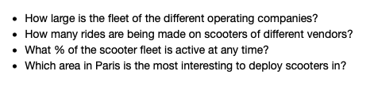

## Analysis

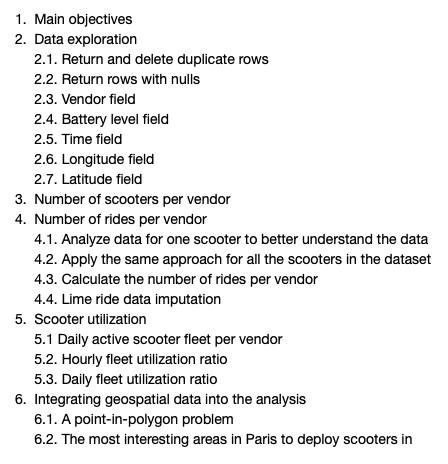

## Main objectives

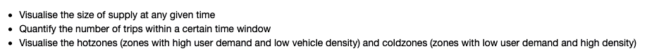

## Screenshots

Scooter fleet

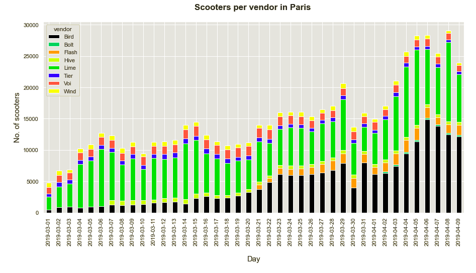
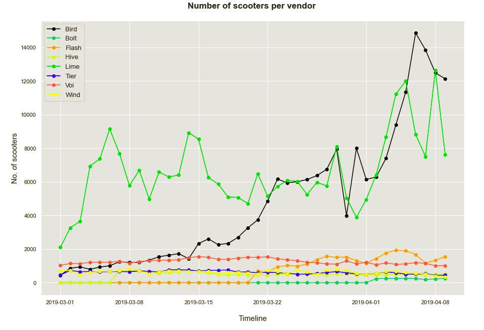
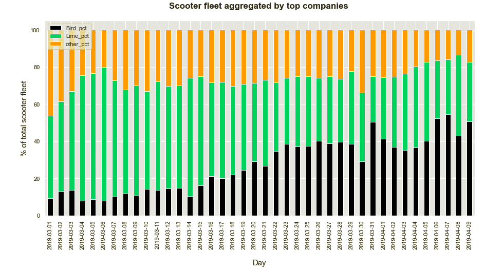

Daily rides per company

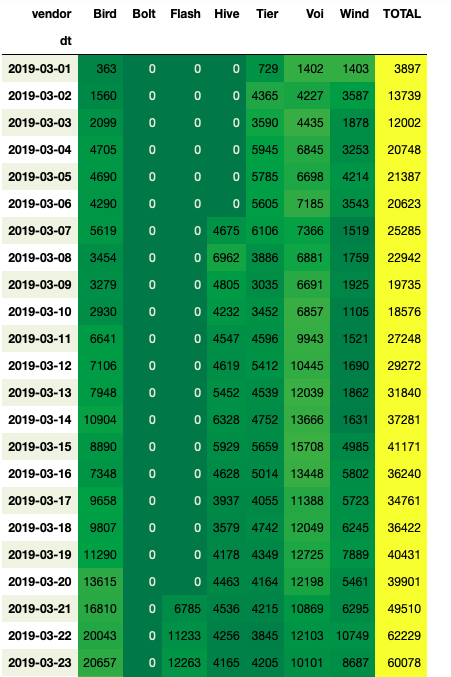
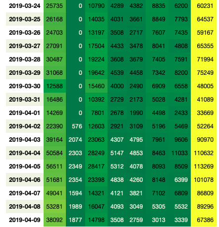

Haversine formula for distance approximation

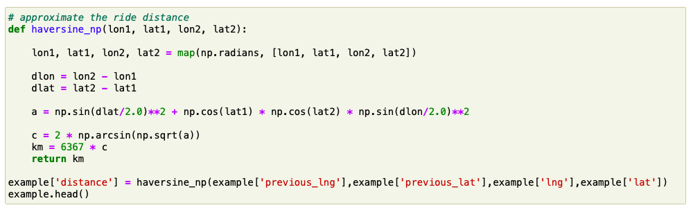

Daily fleet utilization - April 8, 2019

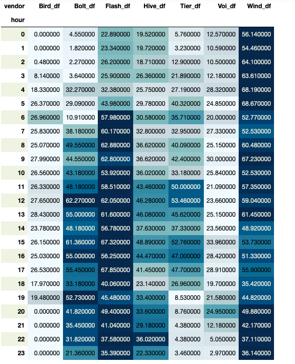

Hourly fleet utilization - April 8, 2019

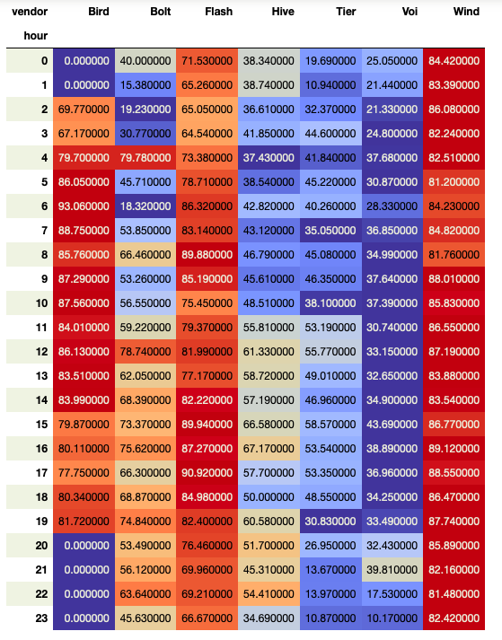

Arrondissements in Paris

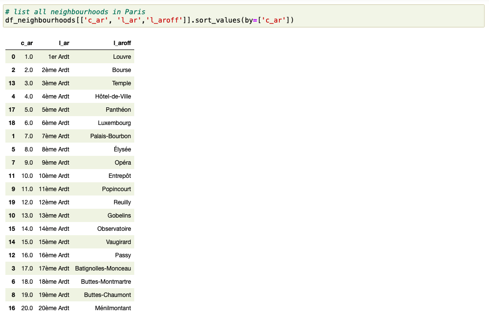

Louvre

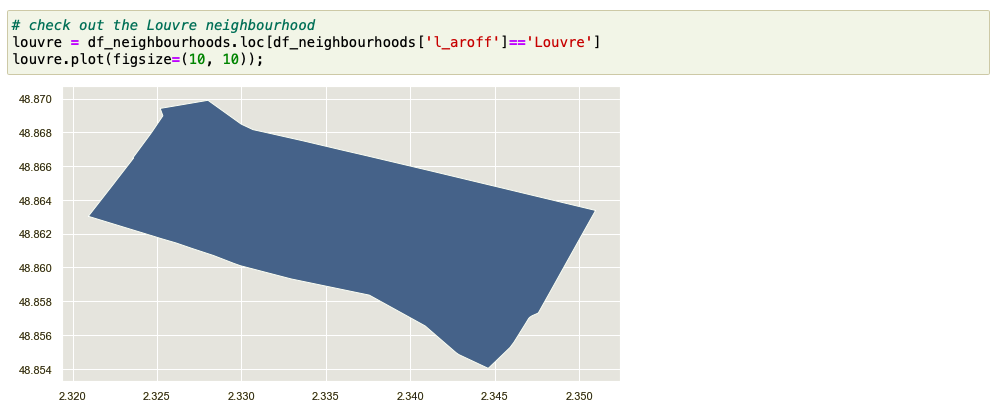

Point in polygon

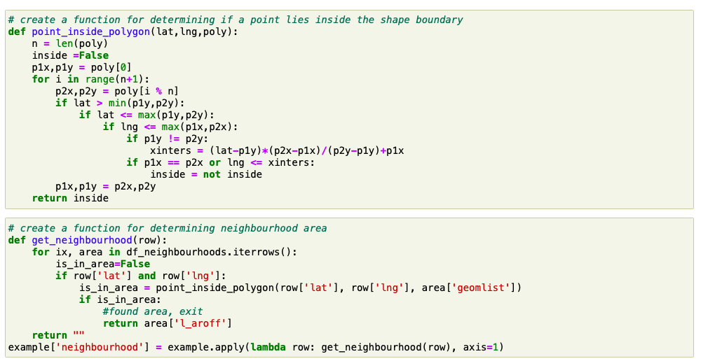
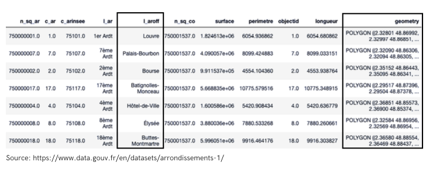
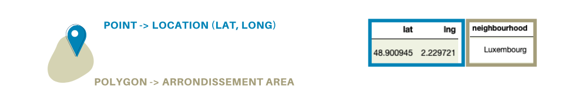

Where to deploy scooters in

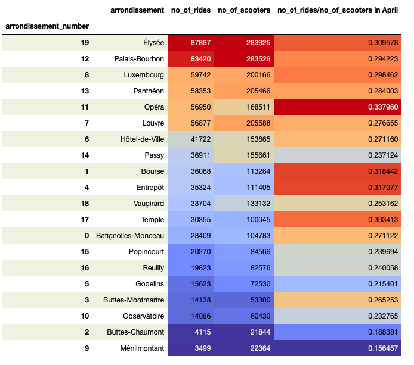

## Status
This project is finished.
